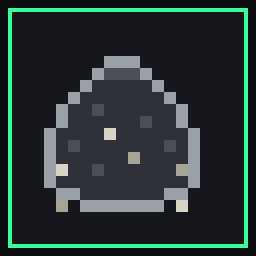

# The Garbage Collector

A silent, pixel-art RPG that teaches **real C++**. You are Wes, the night
janitor of a tower whose garbage collector died years ago — the trash got
organized. Learn the building's maintenance language at wall terminals, unlock
abilities that *are* lines of C++, and mop up the leaks. No music. Keep your
mask on.

This repository is the **free demo** (Floors 0 and 1). It installs and runs as
a standalone desktop app — it is not a browser game.



## Download & install (Windows)

Grab the installer from the [**Releases**](../../releases) page:

- **`TheGarbageCollector-Demo-Setup-<version>.exe`** — run it, pick a folder,
  and it adds a Start Menu / desktop shortcut. Launch it like any other app.

No browser, no internet, no runtime to install — the app ships everything it
needs. A single-file browser build (`the-garbage-collector-demo.html`) is also
attached to the release if you'd rather just double-click an HTML file.

## Controls

**Arrows / WASD** move · **Z** confirm / interact · **X** back · **Enter** kit
menu · **F11** fullscreen. At a wall terminal you type real C++ — **Ctrl+Enter**
compiles & runs it, and **F1** opens escalating hints and a worked solution if
you get stuck.

## What's in the demo

- **Floor 0 — Orientation.** Meet Custodian Pram, learn to move and fight, and
  certify on four terminals: `cout`, variables, `std::string`, and `if/else`.
  Each one you pass unlocks a combat ability.
- **Floor 1 — The Mailroom.** `cin`, string comparison, and `switch/case`, plus
  the mini-boss **MISLABEL** — a headless parcel that lies about its type, weak
  to the very `switch` you just learned.

The code you write is really compiled and run by an in-game C++ interpreter and
graded on behavior, so passing a terminal means your program actually works.

## Build it yourself

```bash
npm install
npm start            # launch the desktop app (builds the renderer, then Electron)
npm run dist         # build the Windows installer into release/
npm run build:demo   # emit the single-file browser build
npm test             # C++ interpreter + content + solution test suites
npm run dev          # web dev server (for development only)
```

- `npm start` / `npm run dist` build the **demo** (Floors 0–1) via the
  `GC_DEMO=1` cap; the full game keeps climbing (the Archives, and beyond).
- Desktop shell: [`electron/main.cjs`](electron/main.cjs). Game source:
  [`src/`](src). Design docs: [`docs/`](docs). Contributor guide:
  [`CLAUDE.md`](CLAUDE.md).

## Design rules (non-negotiable)

- **No music, ever** — the soundscape is synthesized: fluorescent hum, HVAC,
  mechanical SFX.
- **Every human wears a mask** that hides all facial features.
- **Every non-human creature is headless.**
- **The C++ is real** and graded by behavior, never by matching text.

## License

MIT — see [LICENSE](LICENSE).
